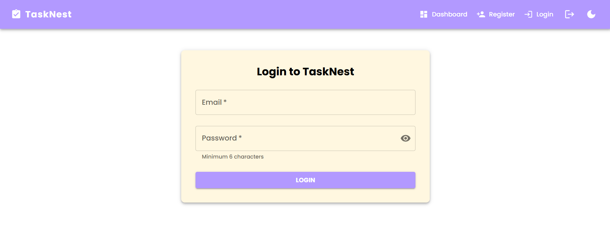

#  TaskNest —  Task Management System

**TaskNest** is a full-featured, scalable, and modern full-stack task management system built with **React.js (frontend)** and **Node.js + Express + MongoDB (backend)**. It provides an intuitive UI, smart task tracking, due-date reminders, user authentication, and a dynamic task progress chart.

##  Project Overview

TaskNest empowers users to:

- **Register/Login securely with hashed passwords using bcrypt**
- **Create, edit, delete tasks**
- **Filter tasks** (❗ Pending • 🔄 In Progress • ✅ Completed)
- **Sort tasks** by due date 
- **Enable Dark Mode** for comfortable viewing
- **Track task progress** via interactive charts
- **Receive reminders** for upcoming deadlines

##  Technologies Used

### Frontend (React.js)
- React 18+
- Material-UI (MUI v5)
- Axios
- React Router DOM
- Chart.js (for visual task analytics)

### Backend (Node.js + Express)
- Express.js
- MongoDB + Mongoose
- JSON Web Tokens (JWT)
- bcrypt.js (for password hashing)
- dotenv (for environment configs)

##  Key Features

###  Authentication & Security
- Secure user registration and login using JWT tokens
- Passwords hashed using bcrypt.js
- Protected routes for dashboard access

###  Task Management
- **Create Task**: Add task title, description, due date
- **Edit Task**: Update any field including changing task status
- **Delete Task**: Remove tasks you no longer need
- **Real-time Status Update**: Change status via dropdown (Pending / In Progress / Completed)

###  Smart Reminders
- Automatically shows reminders in a `Snackbar` if a task is:
  - Due today
  - Due tomorrow
- Visual notification with the task name for quick action

### Task Progress Chart
- Pie chart showing a visual distribution of:
  - Pending Tasks
  - In-progress Tasks
  - Completed Tasks
- Chart dynamically updates as tasks are added or edited

###  Task List Enhancements

- Each task card shows:
  - Title, Description, Due Date, Status Icon (⌛, 🔄, ✅)
  - Edit · Delete buttons, consistently aligned in a grid
- Color-coded cards:
  - ⚠️ Pending = Light Orange
  - 🔄 In Progress = Light Blue
  - ✅ Completed = Light Green

###  Dark Mode Toggle

- Seamless light/dark theme switching
- User preference persists during sessions

###  Task Filtering & Sorting

- **Filter by Status**: show only Pending, In Progress, or Completed tasks
- **Sort by Due Date**: tasks automatically ordered soonest → latest and vice versa

##  Setup Instructions

###  Prerequisites
- Node.js & npm
- MongoDB (cloud or local)

## Screenshots

Here are some key screenshots from the app:

###  Register Page

###  Login Page

###  Dashboard
.png)

###  Dashboard
.png)

